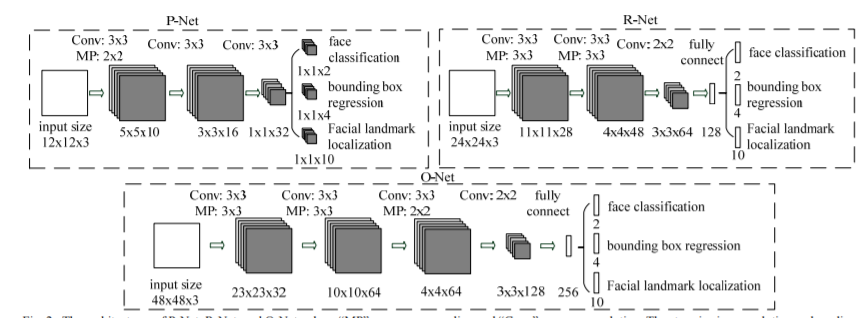

# Real Time Attendence System Using Face Recognition

The idea is to build application for a real-time attendence system using face detection and recognition.

## Prerequisites

* Tensorflow
* Numpy
* PIL
* Sklearn

You can download the weights of pretrained model of MTCNN and Siamese network using download_weights.ipynb notebook file in this repo[Link for downloading weights here !](https://github.com/aadityachapagain/Facial_Recognition_System/blob/master/weight_download.ipynb)

For Siamese network I used pretrained facenet model. [Click here](https://github.com/davidsandberg/facenet) for link of original github link of facenet model.

## Project Examples

## Project Implementation

### Face Detection Using MTCNN

For Face Detection Purpose I used MTCNN network which composed of three cascaded network P-Net, R-Net and O-Net.And to supress the Overlapping Region of Faces I used NMS ( Non-Maximum Supression ) Algorithm to avoid overlapping Region which Represent same Face.

Picture below contain the original link of MTCNN paper which contain all the Mathematical intuition. 

### Face Embeddings Generation Using Res-Net

I used Res-Net for Embeddings Generation of input image which will generate 512 features embeddings of user face which is used to Recognize the Person.

### Using Triplet Loss ( Siamese Network ) for Face Recognition

So, first I used Triplet Loss to recognize the faces of each trained Individual using Siamese network but for small data we can always use Machine learning models when User Information grow larger then we have to use larger and efficent network like siamese network.

### Using Machine learning Classifier
So,I used SVM and RandomForrest machine learning model to train the faces with corresponding labels and used in Face Recognition tasks.

## Applications
* Access and Security
* Criminal Identification
* Healthcare
* Payments
* Photo management Apps

## ToDos
- [x] Face Detection
- [x] face Classification
- [x] Building Classifier
- [X] Real Time face Recognition
- [x] Facial Expression Recognition
- [X] Using Database to Store User when detected with timestamp
- [ ] Integrating Face Recognition and Facial Expression Recognition
- [ ] check if detection can be done faster, if so re-implement it (optimize MTCNN for inference?)
- [ ] Implementing the whole system in browser
- [ ] Making system such that model can be directly updatable from browser