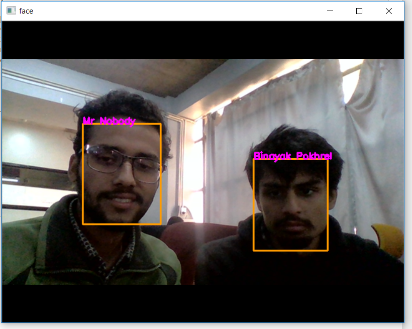
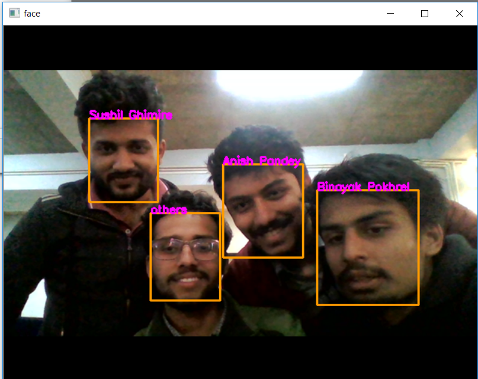

# Real Time Attendence System Using Face Recognition

The idea is to build application for a real-time attendence system using face detection and recognition.

## Prerequisites

* Tensorflow
* Numpy
* PIL
* Sklearn

## Project Examples

[![Audi R8]http://img.youtube.com/vi/wkmn1nWTeIg/0.jpg] (https://www.youtube.com/watch?v=wkmn1nWTeIg "Face Recognition")

## Applications
* Access and Security
* Criminal Identification
* Healthcare
* Payments
* Photo management Apps

## ToDos
- [x] Face Detection
- [x] face Classification
- [x] Building Classifier
- [X] Real Time face Recognition
- [x] Facial Expression Recognition
- [X] Using Database to Store User when detected with timestamp
- [ ] Integrating Face Recognition and Facial Expression Recognition
- [ ] check if detection can be done faster, if so re-implement it (optimize MTCNN for inference?)
- [ ] Implementing the whole system in browser
- [ ] Making system such that model can be directly updatable from browser